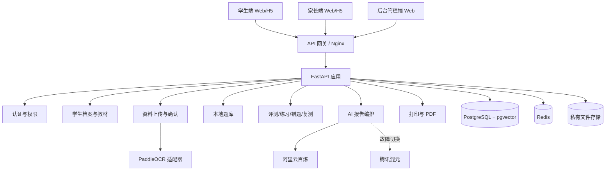

# 学迹智评概要设计说明书（HLD）

## 1. 设计目标

学迹智评 MVP 采用模块化单体架构，优先保证开发效率、数据一致性和低成本部署，同时通过清晰的服务边界为后续拆分微服务预留空间。

设计原则：

- 前后端分离。
- 本地题库是学习闭环的唯一题目来源。
- OCR 与 AI 通过适配器隔离供应商差异。
- 学生敏感数据最小化采集并按家庭隔离。
- OCR、AI 报告和 PDF 生成等耗时任务异步化。
- 业务判断尽量由确定性规则完成，AI 只处理语言理解、总结和建议。

## 2. 总体架构

## 3. 部署架构

MVP 目标环境为单台腾讯云 Ubuntu 服务器：

- Nginx：TLS、静态资源、反向代理、限流。
- Frontend：React 编译后的静态文件。
- Backend：FastAPI + Uvicorn。
- PostgreSQL：业务数据与向量数据。
- Redis：缓存、会话、异步任务状态和限流。
- Worker：OCR、AI 报告和 PDF 任务。
- File Storage：MVP 使用私有本地卷，生产阶段迁移至腾讯云 COS。

## 4. 逻辑模块

### 4.1 身份与家庭模块

职责：

- 注册、登录、刷新令牌、退出。
- 家长、学生、管理员角色授权。
- 家庭、监护关系和主监护人管理。
- 数据访问范围校验。

### 4.2 学生档案与课程模块

职责：

- 学年、学期、学制、行政年级。
- 各科学习水平。
- 分科教材、出版社、修订年份、册次。
- 当前教学进度和确认来源。
- 学期归档和升年级。

### 4.3 上传与 OCR 模块

职责：

- 图片上传、质量检查、哈希去重。
- OCR 任务创建与状态管理。
- OCR 原文和结构化字段保存。
- 低置信度字段标记。
- 家长确认、修改、驳回和审计。

### 4.4 本地题库模块

职责：

- 题目、选项、答案、解析、提示和常见错误。
- 教材目录、知识点和课程标准映射。
- 题目版权、来源、审核和版本。
- 题库覆盖率、正确率、区分度和争议率。

### 4.5 练习与评测模块

职责：

- 诊断、日常、专项、单元、错题和遗忘复测。
- 按知识点、难度、时长和重复率组题。
- 客观题判分。
- 答题过程、提示、用时和中断记录。
- 错题状态机与掌握度更新。

### 4.6 AI 报告模块

职责：

- 汇总成绩、评语、题库表现和学习行为。
- 生成严格 JSON 数据包。
- 调用主模型并在失败时切换备用模型。
- 校验输出结构、证据引用和敏感表达。
- 保存报告版本、模型版本、输入快照和证据。

### 4.7 打印模块

职责：

- 生成练习卷、答案、解析、知识卡和报告。
- 模板版本管理。
- PDF 异步生成和临时下载地址。

### 4.8 后台管理模块

职责：

- 账号、教材、知识点、题库、审核、AI/OCR 配置。
- 运行监控、数据质量、操作日志和系统参数。

## 5. 数据流

### 5.1 成绩/评语录入

1. 用户上传图片。
2. 文件服务保存原图并计算 SHA-256。
3. 创建 OCR 任务。
4. Worker 调用 PaddleOCR。
5. 结构化服务提取成绩或评语标签。
6. 前端显示原图、原文、字段和置信度。
7. 家长确认后生成正式成绩/评语记录。
8. 触发掌握度或 AI 报告数据更新。

### 5.2 练习闭环

1. 学生选择任务。
2. 组题服务按照教材和知识点过滤题目。
3. 学生作答并提交。
4. 判题服务生成答题记录。
5. 错题服务创建或更新错题。
6. 掌握度服务更新知识点状态。
7. 推荐服务生成后续同类题、变式题或复测。

### 5.3 AI 报告

1. 报告编排服务生成数据快照。
2. 规则引擎先计算趋势、指标和确定性结论。
3. 脱敏后调用 AI 生成自然语言和行动建议。
4. JSON Schema 校验。
5. 内容安全检查。
6. 保存报告和证据映射。

## 6. 技术选型

| 层级 | 技术 | 原因 |
|---|---|---|
| 前端 | React、TypeScript、Vite | 生态成熟、适合三角色单页应用 |
| 后端 | FastAPI、Pydantic、SQLAlchemy | API 开发快、类型清晰、便于 AI/OCR 服务接入 |
| 数据库 | PostgreSQL | 关系数据、JSON、全文检索能力完整 |
| 向量 | pgvector | 避免 MVP 额外维护向量数据库 |
| 缓存/队列 | Redis | 会话、限流、缓存和任务状态 |
| OCR | PaddleOCR | 中文、表格和本地部署能力 |
| AI | 百炼主、混元备用 | 中文能力、供应商冗余和兼容适配 |
| 部署 | Docker Compose、Nginx | 单机部署简单，后续可迁移容器平台 |

## 7. 安全架构

- JWT 短期访问令牌 + 可撤销刷新令牌。
- 角色与资源归属双重校验。
- 数据库查询必须带家庭或学生范围。
- 文件默认私有，下载使用短期签名 URL。
- API Key 通过环境变量和密钥服务注入。
- 重要变更写入不可篡改审计日志。
- 日志禁止记录密码、令牌、API Key 和完整学生原图。

## 8. 可扩展性

满足以下条件时拆分独立服务：

- OCR/AI 队列持续占用主应用资源。
- 题库检索 QPS 显著增长。
- PDF 任务影响 API 响应。
- 单机数据库容量或并发接近上限。

优先拆分顺序：Worker → 文件服务 → 题库检索 → 报告服务。
